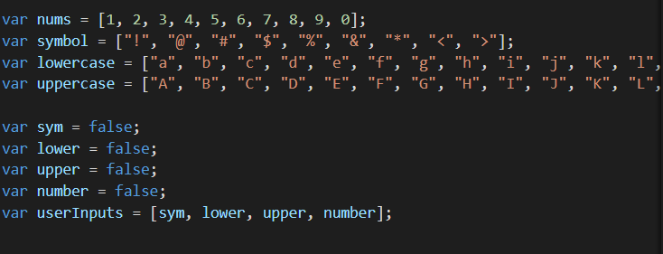
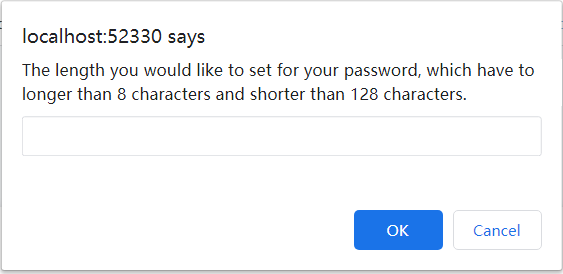
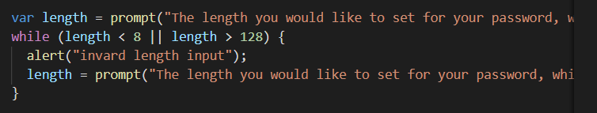
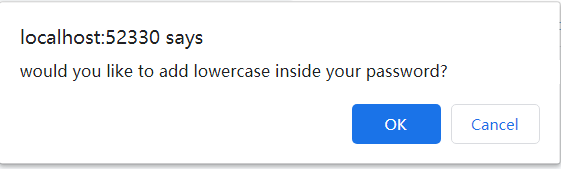
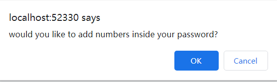
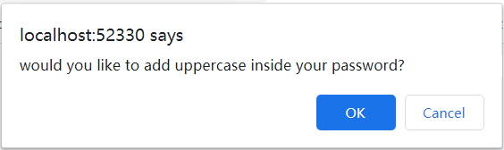
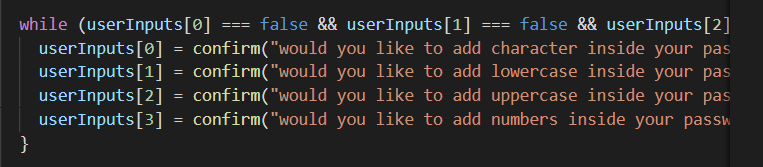
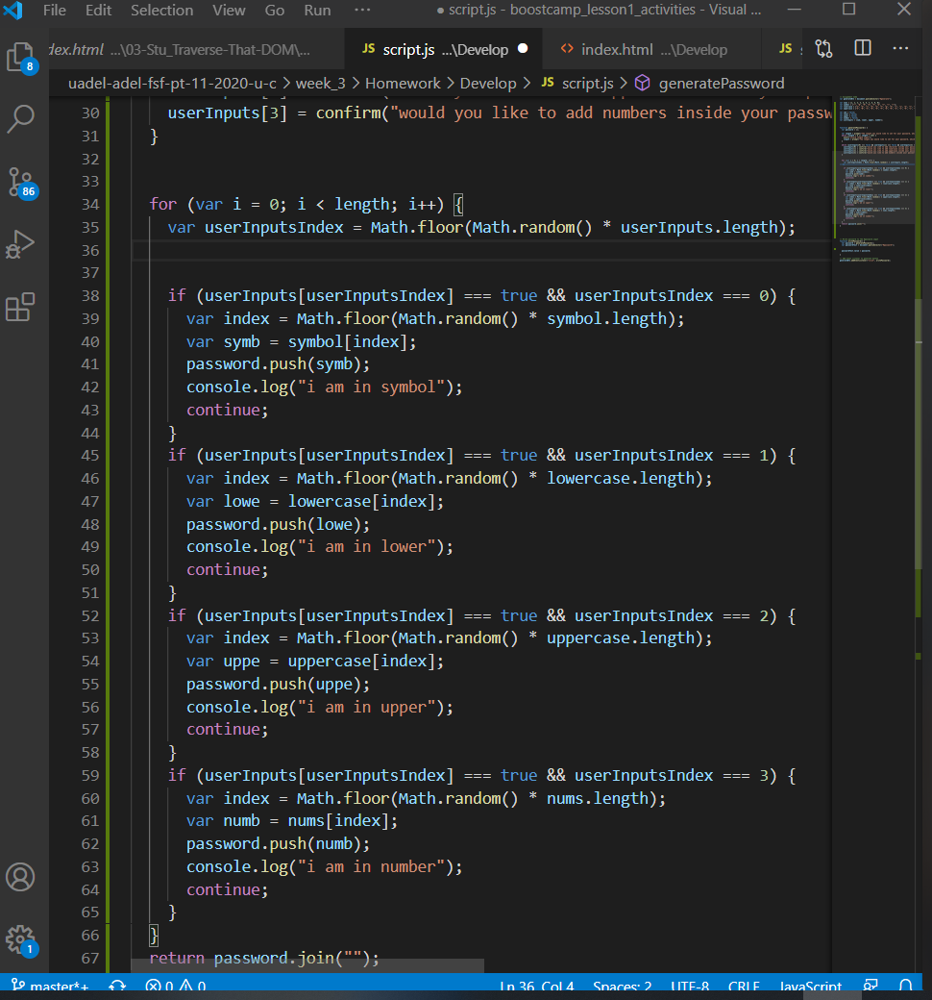

# password-generator

The purpose of the web page is when the user would like to a generate a random number of password and the page will provide them with the desire content and length.  

## functionality 

```

Setting up the var code at the begining.

```


In the page will ask for the desire length of the password from the user, which has to between 8 - 128 characters. Following the code "prompt" is to ask the desire length and the "while" is creating a loop until the users enter the valued answer that been set. 


```





Those confirms are set by the following codes. 


```
After we confirm the desire result from the users, we have set loops to randomly comes up with the desire password for the user. 


